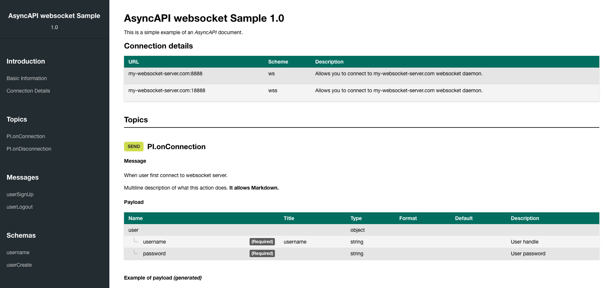

<p align="center"></p>
<p align="center">
  <strong>Websocket Documentation Generator</strong>
</p>
<p align="center">
  <em>Use AsyncAPI definition to generate beautiful<br>human-readable documentation for your API.</em>
</p>
<br><br>

#### Examples

Generate the websocket example:
```bash
npm install
node cli.js websocket.yaml -o ./output
```



## Requirements

* Node.js v7.6+

## Author

## Fork from Fran Méndez's ([docgen](https://github.com/asyncapi/docgen)) project
